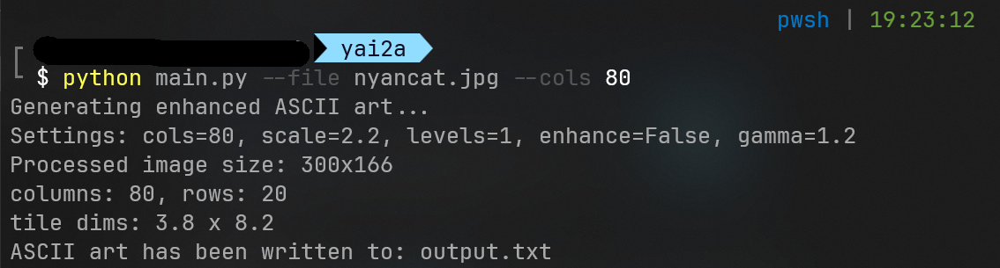

# Yet Another Image 2 ASCII

**YAI2A** is a minimal and efficient Python tool for converting images into ASCII art. Designed for clarity and ease of use, it is ideal for developers, artists, or hobbyists interested in text-based image rendering.

## Features

- Converts standard image formats (e.g., JPG, PNG) to ASCII
- Automatically resizes images for optimal terminal display
- Saves ASCII output to a `.txt` file
- Configurable output width
- Simple, readable source code

## Installation

Clone the repository:

```bash
git clone https://github.com/yourusername/YAI2A.git
cd YAI2A
```

Install dependencies:

```bash
pip install -r requirements.txt
```

> Requires Python 3.8 or higher and [Pillow](https://python-pillow.org/) for image processing.

## Usage

Basic usage:

```bash
python3 main.py <image_path> [output_width]
```

Example:

```bash
python3 main.py sample.png 100
```

- `image_path`: Path to the input image file
- `output_width` (optional): Width of the output in characters (default: 80)

The resulting ASCII art will be saved to `output.txt`.

## Example Output

```
@%#*+=-:.           
@%%##*++=-::..      
@%%%###**++=-::.... 
```

Open `output.txt` to view the complete ASCII output.

## Customization

You can modify:
- The character set used for brightness-to-symbol mapping
- Output file destination
- Default width or image processing behavior

All of this can be adjusted directly in `main.py`.

## License

This project is licensed under the [MIT License](LICENSE).

## Contributing

Contributions are welcome. Feel free to fork the repository and submit a pull request for improvements or new features.

## Contact

For questions or suggestions, feel free to open an issue or contact the project maintainer.
